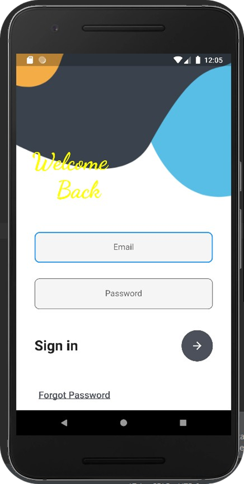
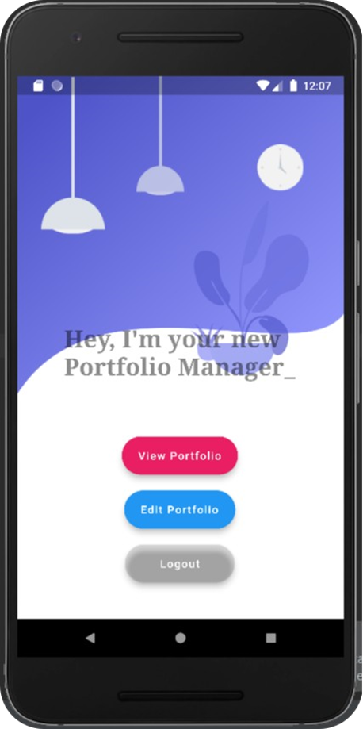

# Portfolio Manager

The Portfolio Manager web application allows the users to easily edit or update the
Content on their personal portfolio website using their mobile phones. Each time users
want to update or edit the content that is being displayed on their websites, rather than
making changes to the code, they can simply tap into this Portfolio Manager application
and achieve the same.

## ScreenShots

|  |   |

---

## Project Created & Maintained By

### Guthy Saiteja

## Project Report

